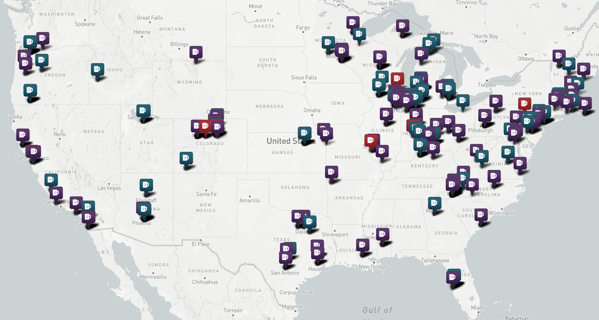

# Beertopia

For beer enthusiasts, the craft beer segment of the alcohol and beverages industry has a ton of options. Some of the questions that are relevant for beer enthusiasts are as follows:-
- How are craft beers differentiated?
- What are the most common beer styles consumed in the US?
- What are the states with the most craft beer consumption?

To answer these questions, we cleaned our dataset and later built a web application that shows various beer styles, a map showing the state with most beer consumption, a data table, and a map showing brewering ratings.

### Data Clean Up Process:

The dataset had ______ number of columns and ______  number of rows. Since our dataset was so large, we had to remove unnecessary data by using Pandas. Our final dataset which only consists of breweries located in US resulting in ______ data. 

## Data Table 

The data table section (data.html) shows the entire data set when loaded. The records are filterable by 4 fields:

 - Brewery Names
 - State
 - Beery Style
 - Brewery Ratings

Datatable is being displayed by calling a .js file with json entries for each record which was created by running a simple csv to json conversion.

```python
import csv
import json

csvfile = open('final_beer.csv', 'r')
jsonfile = open('final_beer.json', 'w')

fieldnames = ("index","brewery_name","city","state","beer_name","style","latitude","longitude","rating","abv_percent")
reader = csv.DictReader( csvfile, fieldnames)
for row in reader:
    json.dump(row, jsonfile)
    jsonfile.write(',\n')
```
The purpose of showing a data table is to have users answer the following questions:
- Which breweries are located near me (or to a particular place)?
- Which beers are produced by these breweries (with ratings and abv info)?
- Which beers have the best rating?

## Map 
The map shows all the breweries in US from the data we have collected. Due to the large number of records which has resulted the page to load very slowly, we decided to only show the first 1500 records from our data. 

#### Getting Coordinates
The data file only had the list of brewery names, city and state. To map each breweries, we used Google Maps API to get the coordinates.

The map was possible using Leaflet Extra Markers and Font Awesome. Clicking on the marker will show the name of the breweries and their respective ratings. The control buttons which are located on the top right corner lets you filter the breweries by their ratings. Breweries with a rating of less than 4 are marked red, between 4.1 to 4.5 are marked blue and greater than 4.5 are marked purple.



### Challenges/Limitations: 

## Contributors <br/>
 - Sai
 - Dan
 - Deepen
 - Pratikchhya
 - Pavana
